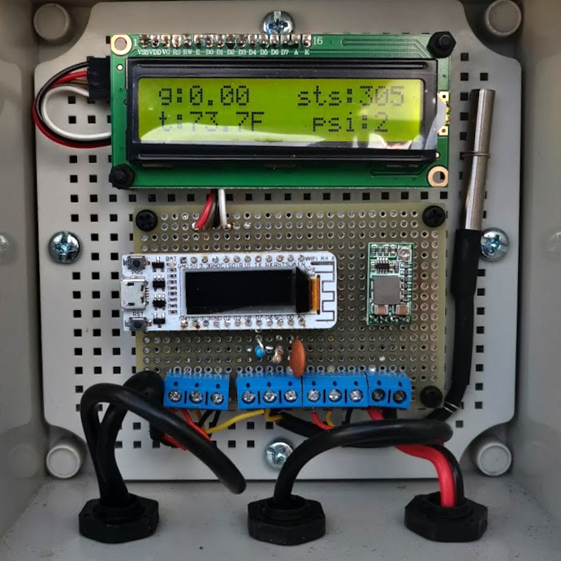
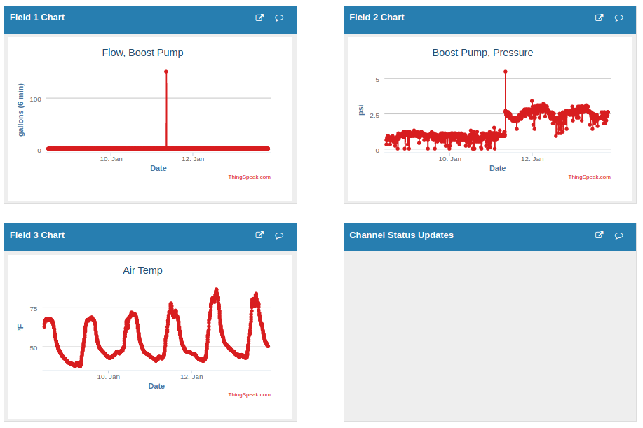
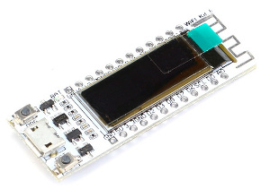
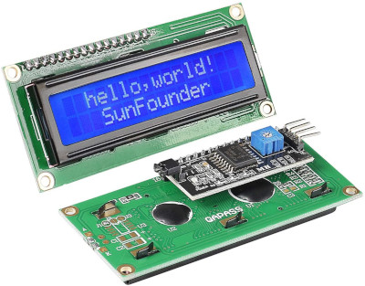
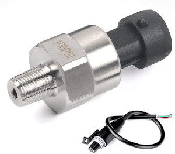
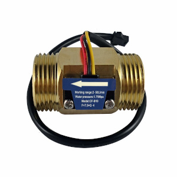

# farm-mon -- Simple Farm Monitoring System

This system is used to confirm that the remote farm's irrigation system is running 
by sending water pressure, water flow and temperature readings every 6 minutes to
Thingspeak to display as curves.



# Thingspeak

Here's what the plot will look like. Go to www.thingspeak.com to setup an account.
A free account is all that is needed. You will need the API key to upload data.



# Power
Internet connection is via a mobile wifi hotspot that is run by a 12V battery
charged with a small (20W) solar panel.

The 12V is reduced to 5V using a small 5V buck SMPS board.

# MCU

This originally was written for the Heltec Wifi Kit 8. But the display
was so tiny that the 16x2 LCD display was added.

* ESP8266
* 0.91" OLED, 128x32, SSD1306 controller
* 4 MB flash



## MCU Pin Assignments

```
            Heltec Wifi Kit 8

            +-----+----+-----+
            |     | USB|     |
            |GND  +----+  GND|
            |5V            5V|
            |3V3          3V3|
            |GND          GND|
  (OLED_SDA)|D2           CTS|
    (BUTTON)|D3           DTR|
            |D8            D1|(OLED_SCL)
     ONEWIRE|D7            TX|
            |D6            RX|
  FLOW_PULSE|SCL          RST|
  (OLED_RST)|D0           SUA|
    PRESSURE|A0            EN|
            +----------------+

    ONEWIRE -- Onewire bus. Pull up to 5V for highest reliability. Pin is 5V tolerant.
    FLOW_PULSE -- Flow sensor pulse input. Filter with 1k series and 0.05 uF to GND.
    PRESSURE -- Analog pressure sensor input.
```

# Display

A standard 16x2 character LCD was used (old Hitachi interface) but with an I2C
expander board to make interfacing much easier. These are available readily at
low cost.



# Sensors

## Pressure

TUAYAUTO 100 Psi Pressure Transducer

* 1/8" -27 NPT 27 NPT Thread
* Stainless for Oil Fuel Air Water Pressure with Harness
* $18.99 from [Amazon](https://www.amazon.com/dp/B08G8MCGKH)
* 0.5V – 4.5V Output. 0 psi outputs 0.5V, 50 psi outputs 2.5V, 100 psi outputs 4.5V.
* For fuel, oil, air, water pressure inputs, can be used in oil tank, gas tank, and more



## Flow Sensor



DIGITEN G1" Male Thread Brass Water Flow Sensor, Hall Effect Sensor Flow Meter

This flow sensor switch is made of brass, all materials are in line with ROHS testing standards.

* G1" male thread (British standard). See [NPT vs BSP](https://pipeandhose.com/book/npt-vs-bsp-pipe).
* 2-50L/min
* $18.99 from [Amazon](https://www.amazon.com/dp/B07QLPBFZ3)
* Flow range: 2-50L/min. Working Voltage Range: DC5-15V.
* Max working pressure: 1.75MPa.

**Note 1:** I calibrated this by running a garden hose into a 5 gallon bucket and 
recording the number of pulses counted. But when we ran it at the farm, the indicated
flow rate was much higher (by 3x or 4x!) what was expected. This needs to be investigated.

**Note 2:** The pulse counting is done with an interrupt in MicroPython. MicroPython is
slow. But testing indicated that it ran fast enough to accurately count up to 2,000 pulses
per second.

**Note 3:** Even with lots of teflon tape, there's still a small leak because of the
difference between British thread shape (this device) and US pipe threads. This was
tolerable. Flow sensors with US threads at McMaster-Carr are about $300.

**Note 3:** There's a bug in the code where the flow rate will suddenly read something
like 160 gallons (per period). Haven't figured this out yet.

## Flow Sensor Adapter

* https://www.amazon.com/dp/B08GBYR1KB
* G Thread (Metric BSPT) Female to NPT Thread Male Pipe Fitting Adapter - Lead-Free (1" x 1")

# Setup

## config.json

Configuration file is named `config.json` and should have contents like this:
```
{
    "hostname": "esp-farm-mon",
    "ssid": "hotspot1",
    "pwd": "hotspot-password",
    "1wire_addr1": [40, 255, 163, 113, 0, 23, 3, 114],
    "api_key": "MYTHINGSPEAKAPIKEY"
}
```

Where:

* `1wire_addr1` -- list representing 8 byte of 1-wire ID of temperature sensor
* `hostname` -- name of this MCU board (shows up in WiFi AP list)
